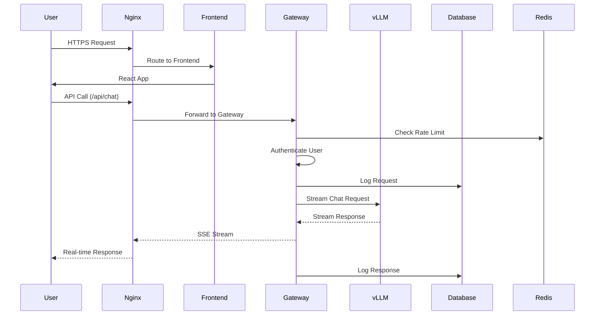

# 🏗️ vLLM 챗봇 서비스 아키텍처 문서

본 문서는 vLLM 기반 챗봇 서비스의 전체 아키텍처, 기술 스택 선택 근거, 설계 원칙을 설명합니다.

## 🎯 프로젝트 개요

### 비즈니스 목표

- **고성능**: RTX 3090 x2 GPU를 활용한 최적 성능
- **확장성**: 단일 노드에서 멀티 노드로 확장 가능
- **안정성**: 24/7 운영 가능한 견고한 시스템
- **개발 효율성**: 빠른 개발과 배포를 위한 현대적 스택

### 핵심 요구사항

- **TTFT < 2초**: 사용자 경험 최우선
- **동시 사용자 10+**: 멀티 유저 지원
- **99.5% 가용성**: 안정적인 서비스 제공
- **보안**: 인증, 인가, 데이터 보호

## 🏛️ 전체 아키텍처

### 시스템 구성도

```
┌─────────────────────────────────────────────────────────────────┐
│                         Client Layer                            │
├─────────────────────────────────────────────────────────────────┤
│  Web Browser  │  Mobile App  │  API Clients  │  3rd Party      │
└─────────────────────────────────────────────────────────────────┘
                                │
                                ▼
┌─────────────────────────────────────────────────────────────────┐
│                      Load Balancer                             │
├─────────────────────────────────────────────────────────────────┤
│                        Nginx                                    │
│  • SSL Termination     • Static Files    • Rate Limiting       │
│  • Reverse Proxy       • Compression     • Security Headers    │
└─────────────────────────────────────────────────────────────────┘
                                │
                ┌───────────────┼───────────────┐
                ▼               ▼               ▼
┌─────────────────────┐ ┌─────────────────┐ ┌─────────────────┐
│   Frontend Layer    │ │  Gateway Layer  │ │  Static Assets  │
├─────────────────────┤ ├─────────────────┤ ├─────────────────┤
│      React          │ │    FastAPI      │ │   CDN/Storage   │
│   • SPA UI          │ │ • Authentication│ │  • Images       │
│   • Real-time Chat  │ │ • Rate Limiting │ │  • Documents    │
│   • State Mgmt      │ │ • Input Valid.  │ │  • Cache        │
└─────────────────────┘ └─────────────────┘ └─────────────────┘
                                │
                                ▼
┌─────────────────────────────────────────────────────────────────┐
│                     Processing Layer                           │
├─────────────────────────────────────────────────────────────────┤
│                        vLLM Server                             │
│  • Model Serving       • Tensor Parallel    • KV Cache        │
│  • OpenAI Compatible   • GPU Optimization   • Batch Process   │
└─────────────────────────────────────────────────────────────────┘
                                │
                ┌───────────────┼───────────────┐
                ▼               ▼               ▼
┌─────────────────────┐ ┌─────────────────┐ ┌─────────────────┐
│   Database Layer    │ │   Cache Layer   │ │  Storage Layer  │
├─────────────────────┤ ├─────────────────┤ ├─────────────────┤
│    PostgreSQL       │ │      Redis      │ │  File System    │
│ • User Data         │ │ • Session Cache │ │ • Model Cache   │
│ • Conversations     │ │ • Rate Limits   │ │ • Logs          │
│ • Request Logs      │ │ • Temp Data     │ │ • Backups       │
└─────────────────────┘ └─────────────────┘ └─────────────────┘
```

### 데이터 플로우



## 🔧 기술 스택 및 선택 근거

### Frontend - React + Vite

**선택 이유:**

- **개발 효율성**: Vite의 빠른 HMR과 빌드
- **생태계**: 풍부한 라이브러리와 커뮤니티
- **SSE 지원**: 실시간 스트리밍 채팅 구현에 적합
- **TypeScript**: 타입 안정성과 개발자 경험

**주요 라이브러리:**

```typescript
{
  "react": "^18.2.0",           // 최신 React 기능
  "zustand": "^4.4.6",         // 경량 상태 관리
  "tailwindcss": "^3.3.5",     // 유틸리티 CSS
  "react-markdown": "^9.0.1",  // 마크다운 렌더링
  "lucide-react": "^0.400.0"   // 아이콘 라이브러리
}
```

### Gateway - FastAPI

**선택 이유:**

- **성능**: 높은 동시성과 async/await 지원
- **타입 안전성**: Pydantic을 통한 자동 검증
- **문서화**: 자동 OpenAPI/Swagger 문서 생성
- **에코시스템**: ML/AI 생태계와의 자연스러운 통합

**핵심 기능:**

```python
# 주요 의존성
fastapi = "0.104+"           # 고성능 웹 프레임워크
uvicorn = "0.24+"            # ASGI 서버
pydantic = "2.5+"            # 데이터 검증
sqlalchemy = "2.0+"          # ORM
asyncpg = "0.29+"            # 비동기 PostgreSQL 드라이버
```

### AI Engine - vLLM

**선택 이유:**

- **성능**: PagedAttention으로 메모리 효율성 극대화
- **호환성**: OpenAI API 완벽 호환
- **확장성**: 멀티 GPU, Tensor Parallel 지원
- **최적화**: CUDA 커널 최적화로 높은 처리량

**설정 최적화:**

```bash
--tensor-parallel-size 2      # RTX 3090 x2 활용
--gpu-memory-utilization 0.55 # OOM 방지
--max-model-len 8192         # 긴 컨텍스트 지원
--dtype float16              # 메모리 절약
```

### Database - PostgreSQL

**선택 이유:**

- **ACID 준수**: 데이터 일관성 보장
- **JSON 지원**: 유연한 스키마 설계
- **확장성**: 인덱싱과 파티셔닝 지원
- **성숙도**: 안정적이고 검증된 솔루션

**스키마 설계:**

```sql
-- 핵심 테이블들
users           -- 사용자 정보
conversations   -- 대화 세션
messages        -- 메시지 내역
request_logs    -- API 요청 로그 (분석용)
```

### Cache - Redis

**선택 이유:**

- **성능**: 인메모리 저장으로 빠른 액세스
- **다양한 자료구조**: 레이트 리밋, 세션 관리에 적합
- **지속성**: AOF/RDB로 데이터 보존 가능
- **클러스터링**: 수평 확장 지원

### Proxy - Nginx

**선택 이유:**

- **성능**: 높은 동시 연결 처리 능력
- **SSL/TLS**: 보안 연결 처리
- **로드밸런싱**: 멀티 인스턴스 지원
- **정적 파일**: 효율적인 정적 자산 서빙

## 🔐 보안 아키텍처

### 인증 및 인가

```
┌─────────────┐    JWT Token    ┌─────────────┐
│   Client    │ ────────────►  │  Gateway    │
└─────────────┘                 └─────────────┘
                                       │
                                       ▼
                                ┌─────────────┐
                                │  Database   │
                                │ (User Info) │
                                └─────────────┘
```

**보안 계층:**

1. **네트워크 보안**: HTTPS, TLS 1.2+
2. **애플리케이션 보안**: JWT 토큰, CORS 정책
3. **데이터 보안**: SQL Injection 방지, 입력 검증
4. **인프라 보안**: 방화벽, VPC, 접근 제어

### 데이터 보호

```python
# 개인정보 마스킹
def mask_sensitive_data(data: dict) -> dict:
    sensitive_fields = ['password', 'email', 'phone']
    for field in sensitive_fields:
        if field in data:
            data[field] = "***masked***"
    return data

# 로그 필터링
@app.middleware("http")
async def log_requests(request: Request, call_next):
    # PII 제거 후 로깅
    safe_data = mask_sensitive_data(request_data)
    logger.info("Request processed", data=safe_data)
```

## 📊 성능 및 확장성

### 성능 최적화 전략

#### 1. GPU 레이어 최적화

```bash
# vLLM 최적화
--tensor-parallel-size 2          # 멀티 GPU 활용
--pipeline-parallel-size 1        # 파이프라인 병렬화
--max-num-seqs 128               # 배치 크기 최적화
--block-size 16                  # 메모리 블록 크기
```

#### 2. 네트워크 레이어 최적화

```nginx
# Nginx 최적화
worker_processes auto;
worker_connections 1024;
keepalive_timeout 65;

# SSE 스트리밍 최적화
proxy_buffering off;
proxy_cache off;
chunked_transfer_encoding on;
```

#### 3. 데이터베이스 최적화

```sql
-- 인덱스 전략
CREATE INDEX CONCURRENTLY idx_messages_conversation_created
ON messages (conversation_id, created_at DESC);

-- 연결 풀링
SQLALCHEMY_POOL_SIZE = 20
SQLALCHEMY_MAX_OVERFLOW = 30
```

### 확장성 설계

#### 수평 확장 (Scale-out)

```yaml
# Kubernetes 배포 예시
apiVersion: apps/v1
kind: Deployment
metadata:
  name: vllm-gateway
spec:
  replicas: 3
  selector:
    matchLabels:
      app: gateway
  template:
    spec:
      containers:
        - name: gateway
          image: vllm-gateway:latest
          resources:
            requests:
              cpu: 500m
              memory: 1Gi
            limits:
              cpu: 2000m
              memory: 4Gi
```

#### 수직 확장 (Scale-up)

```bash
# 더 강력한 GPU로 업그레이드
RTX 3090 → RTX 4090 → A100
메모리: 24GB → 48GB → 80GB
```

## 🔄 CI/CD 파이프라인

### 개발 워크플로우

```yaml
# .github/workflows/deploy.yml
name: Deploy vLLM Service
on:
  push:
    branches: [main]

jobs:
  test:
    runs-on: ubuntu-latest
    steps:
      - uses: actions/checkout@v3
      - name: Run Tests
        run: |
          docker compose -f docker-compose.test.yml up --abort-on-container-exit

  build:
    needs: test
    runs-on: ubuntu-latest
    steps:
      - name: Build Images
        run: |
          docker compose build
          docker compose push

  deploy:
    needs: build
    runs-on: self-hosted
    steps:
      - name: Deploy to Production
        run: |
          docker compose pull
          docker compose up -d --no-deps
```

### 배포 전략

1. **Blue-Green 배포**: 무중단 서비스 전환
2. **Canary 배포**: 점진적 트래픽 전환
3. **롤백 계획**: 빠른 이전 버전 복구

## 📈 모니터링 및 관찰성

### 메트릭 수집

```python
# Prometheus 메트릭
REQUEST_COUNT = Counter('chat_requests_total',
                       'Total requests', ['model', 'status'])
REQUEST_DURATION = Histogram('chat_request_duration_seconds',
                            'Request duration')
GPU_UTILIZATION = Gauge('gpu_utilization_percent',
                       'GPU utilization')
```

### 로깅 전략

```python
# 구조화된 로깅
import structlog

logger = structlog.get_logger()
logger.info("Chat request processed",
           user_id=user.id,
           model=request.model,
           input_tokens=len(request.messages),
           output_tokens=response.usage.completion_tokens,
           latency_ms=latency)
```

### 대시보드 구성

**핵심 KPI 대시보드:**

- 응답시간 (p50, p95, p99)
- 처리량 (RPS)
- 에러율
- GPU 사용률
- 사용자 활성도

## 🚀 미래 확장 계획

### 단기 계획 (3-6개월)

- **RAG 통합**: 벡터 데이터베이스 연동
- **다중 모델**: 모델별 라우팅 시스템
- **고급 인증**: RBAC, SSO 연동

### 중기 계획 (6-12개월)

- **Kubernetes 마이그레이션**: 컨테이너 오케스트레이션
- **마이크로서비스 분해**: 독립적 서비스 단위
- **글로벌 배포**: 다중 리전 지원

### 장기 계획 (1-2년)

- **AI 모델 파이프라인**: 자동 모델 튜닝
- **엣지 컴퓨팅**: 로컬 추론 최적화
- **연합 학습**: 프라이버시 보호 학습

## 📋 기술 부채 및 개선점

### 현재 제한사항

1. **단일 노드 의존성**: GPU 서버 장애 시 전체 서비스 중단
2. **모델 크기 제약**: 24GB GPU 메모리 한계
3. **동시성 제한**: vLLM 배치 처리 한계

### 개선 계획

1. **고가용성**: Active-Standby 구성
2. **모델 최적화**: 양자화, 프루닝 적용
3. **캐싱 전략**: 응답 캐시, 프리컴퓨팅

## 🎯 결론

본 아키텍처는 **성능, 확장성, 안정성**의 균형을 맞춘 설계로, vLLM의 강력한 GPU 최적화와 현대적인 웹 기술 스택을 결합하여 고품질 AI 챗봇 서비스를 제공합니다.

**핵심 설계 원칙:**

- **성능 우선**: GPU 리소스 최대 활용
- **점진적 확장**: 단계별 성장 지원
- **운영 효율성**: 자동화된 배포 및 모니터링
- **개발자 친화적**: 명확한 구조와 문서화

이러한 아키텍처를 통해 안정적이고 확장 가능한 AI 서비스 플랫폼의 기반을 마련했습니다. 🏗️
